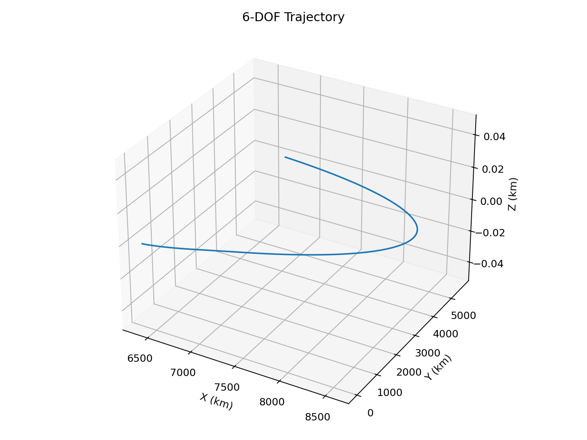
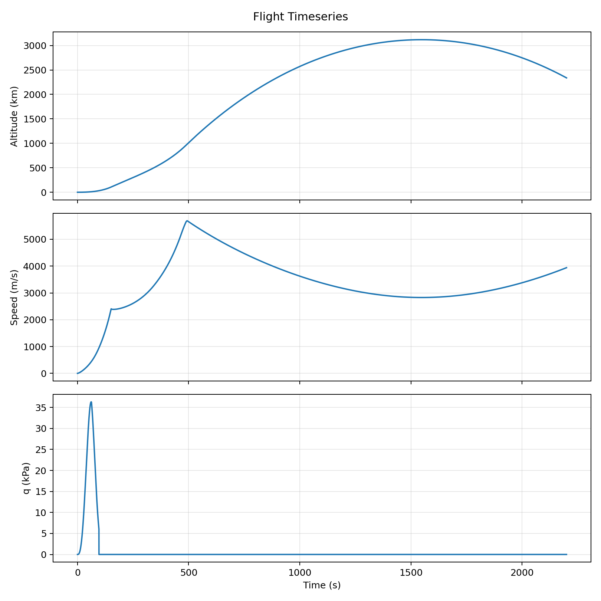
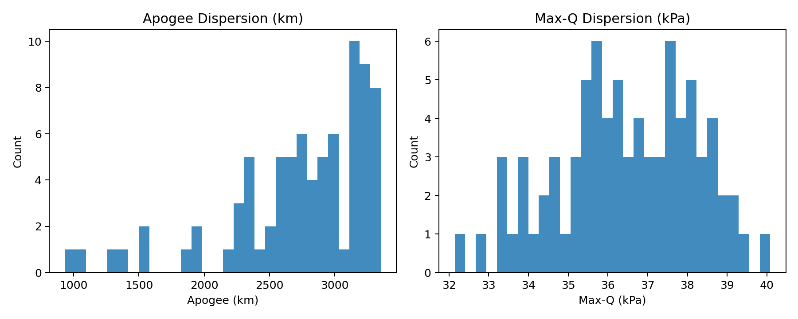
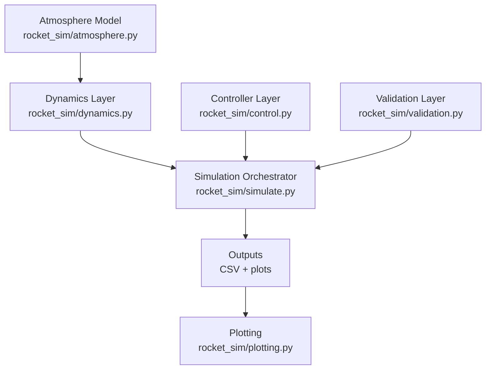

# Multi-Stage Rocket Dynamics Simulator

A flight-systems simulation project for multi-stage launch vehicles with 6-DOF rigid-body propagation, closed-loop attitude control, autonomous phase/event logic, and quantitative validation against analytical and SciPy references.

## Tech Stack

C++, Python, NumPy, SciPy, Matplotlib

## Key Capabilities

- 6-DOF state propagation: position, velocity, attitude, body rates, and mass
- RK4 integrator for nonlinear flight dynamics
- US Standard Atmosphere 1976 density + drag + dynamic pressure (Max-Q) computation
- Closed-loop PID attitude control with TVC gimbal commands
- Multi-stage burnout/separation with configurable staging delay
- 7-state flight phase engine:
  - `IGNITION -> ASCENT -> STAGING -> COAST -> APOGEE -> REENTRY -> LANDING`
- Autonomous detection of `MECO`, `staging`, `apogee`, `reentry`, and `landing`
- Analytical baseline checks + SciPy cross-check pipeline
- Native C++ simulation core (`cpp/include/rocket_sim_cpp.hpp`, `cpp/src/rocket_sim_cpp.cpp`) with RK4, staging, atmosphere, and CSV output

## Demo Artifacts

**3D Trajectory**



**Altitude / Speed / Dynamic Pressure**



**Monte Carlo Dispersion (Apogee / Max-Q)**



## Architecture



Layer responsibilities:

- Dynamics layer: force/torque models, mass depletion, RK4 step function
- Controller layer: PID loop producing TVC gimbal commands
- State machine/event layer: flight phases + event transitions in `simulate.py`
- Validation layer: analytical rocket-equation baseline and SciPy ODE reference checks
- Output layer: CSV state export and plot generation

## Modeling Equations

Translational dynamics:

- $\dot{r} = v$
- $\dot{v} = g(r) + \frac{F_T + F_D}{m}$
- $g(r) = -\mu \frac{r}{\|r\|^3}$

Drag and mass flow:

- $F_D = -\frac{1}{2}\rho V^2 C_d A \,\hat{v}$
- $q = \frac{1}{2}\rho V^2$
- $\dot{m} = -\frac{T}{I_{sp}g_0}$

## Assumptions and Limitations

- Point-mass gravity model with inverse-square law
- 1976 standard atmosphere profile; no real-time weather/wind field
- Simplified aerodynamic drag (lumped $C_dA$ model)
- Rigid-body approximation; no structural flex/slosh coupling
- TVC modeled with bounded gimbal commands
- No sensor noise, actuator lag, or onboard estimator model
- No aero-heating, plume interaction, or high-fidelity CFD coupling

## Quickstart (Python)

```bash
cd /path/to/6dof-rocket-trajectory-simulator
python3 -m venv .venv
source .venv/bin/activate
pip install -r requirements.txt
MPLCONFIGDIR=$PWD/.mplconfig PYTHONPATH=. python main.py --dt 0.1 --duration 2200
```

## Scenario Configs

Run deterministic scenarios without code changes:

- `configs/nominal.yaml`
- `configs/high_wind.yaml`
- `configs/thrust_loss.yaml`
- `configs/heavy_payload.yaml`

Example:

```bash
MPLCONFIGDIR=$PWD/.mplconfig PYTHONPATH=. python main.py --config configs/high_wind.yaml --seed 42
```

## Reproducible Commands

```bash
make test
make validate
make run
make montecarlo
```

## Optional C++ Baseline Build

```bash
cd /path/to/6dof-rocket-trajectory-simulator
cmake -S . -B build
cmake --build build
./build/rk4_reference
```

## C++ Simulation Core Run

```bash
cd /path/to/6dof-rocket-trajectory-simulator
make cpp-run
```

This produces `outputs/cpp_flight_states.csv` from the native C++ simulator executable (`cpp_sim`).

## C++ Validation Gate

```bash
cd /path/to/6dof-rocket-trajectory-simulator
make cpp-validate
```

`cpp_validate` executes threshold checks and event/phase ordering directly in C++.

## Validation Methodology

Validation components:

- Analytical baseline: closed-form vertical-burn reference
- Numerical cross-check: SciPy `solve_ivp` against RK4 implementation
- Automated tests: atmosphere behavior, staging transitions, state-machine behavior, and error-threshold checks
- CI gate: `.github/workflows/ci.yml` runs tests, validation, and Monte Carlo smoke checks on every push/PR

Reference run (`python main.py --dt 0.1 --duration 2200`):

- Apogee: `3118.50 km` at `t = 1547.9 s`
- Max-Q (ascent, 0-80 km): `36.32 kPa` at `t = 61.7 s`
- Steady-state attitude error (`t > 40 s`): `0.12 deg`
- RK4 trajectory error vs analytical baseline: `0.000%` (SciPy cross-check: `0.000%`)
- Detected events: `MECO`, `staging`, `apogee`, `reentry`

Monte Carlo dispersion (`python scripts/monte_carlo.py --runs 80 --seed 123 --duration 1200 --dt 0.15`):

- Apogee P50/P95: `2851.68 / 3286.77 km`
- Max-Q P50/P95: `36.47 / 39.02 kPa`

## Repository Structure

- `main.py`: CLI entrypoint and run summary
- `rocket_sim/models.py`: configuration and state dataclasses
- `rocket_sim/dynamics.py`: core EOM + RK4 integrator
- `rocket_sim/control.py`: PID controller logic
- `rocket_sim/simulate.py`: phase engine, event detection, simulation loop
- `rocket_sim/validation.py`: analytical/SciPy validation helpers
- `rocket_sim/plotting.py`: plot and CSV generation
- `cpp/rk4_reference.cpp`: optional C++ RK4 reference executable
- `cpp/include/rocket_sim_cpp.hpp`: C++ core data model + public simulation API
- `cpp/src/rocket_sim_cpp.cpp`: native C++ RK4 dynamics/staging implementation
- `cpp/src/sim_main.cpp`: C++ CLI simulator entrypoint
- `cpp/src/validate_main.cpp`: native C++ validation gate executable
- `scripts/validate.py`: threshold gate for regression prevention
- `scripts/monte_carlo.py`: uncertainty dispersion runner
- `configs/*.yaml`: scenario configuration files
- `tests/test_sim.py`: regression and validation tests

## Tests

```bash
cd /path/to/6dof-rocket-trajectory-simulator
source .venv/bin/activate
PYTHONPATH=. pytest -q tests/test_sim.py
```
