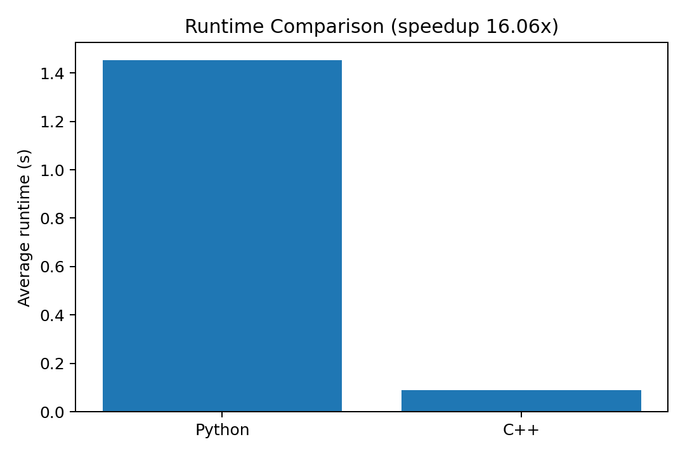
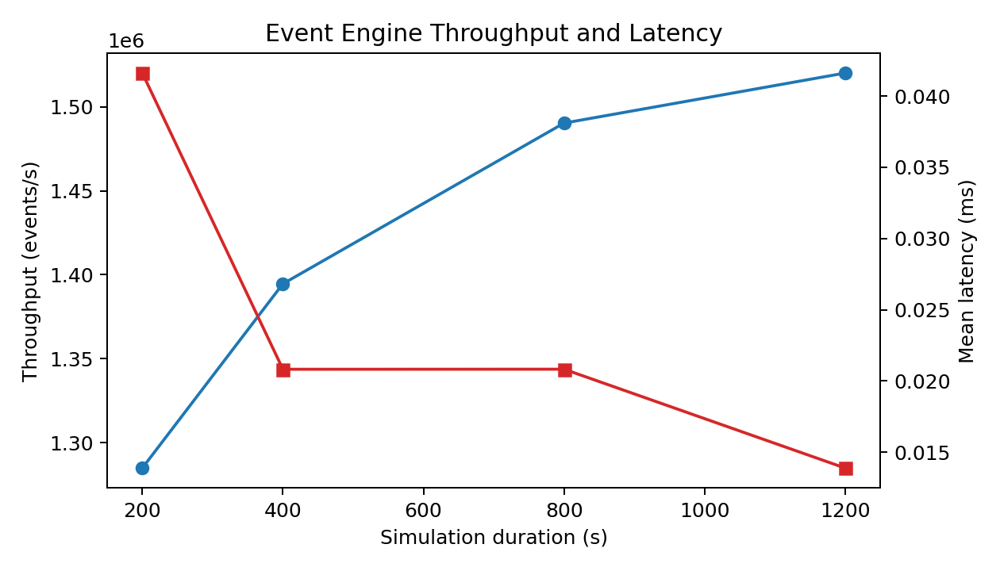
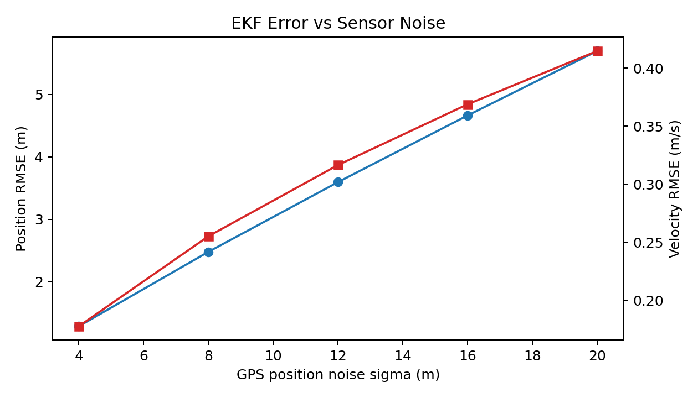
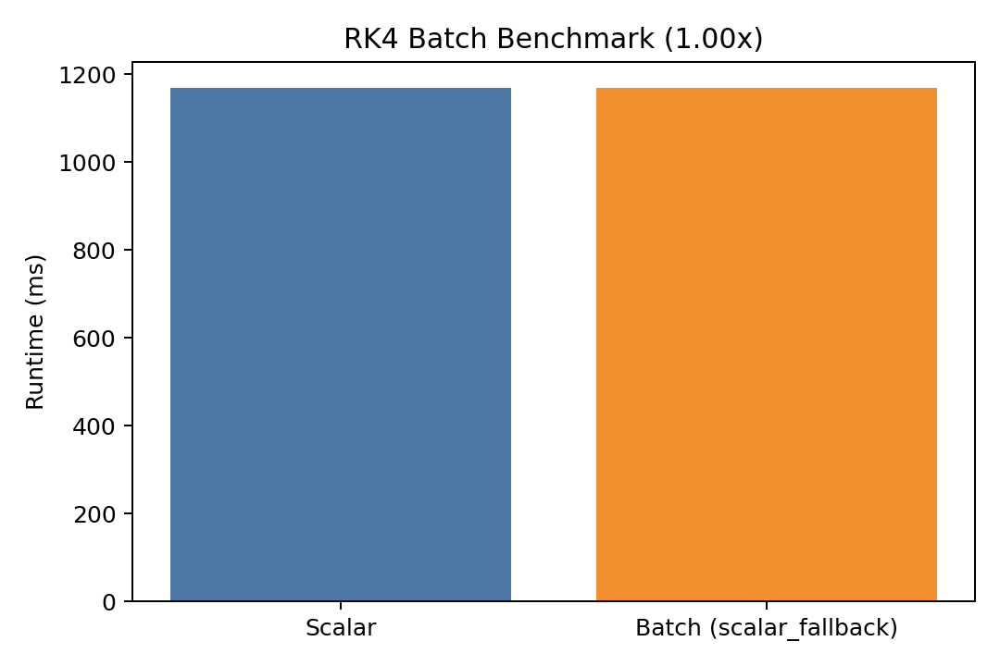
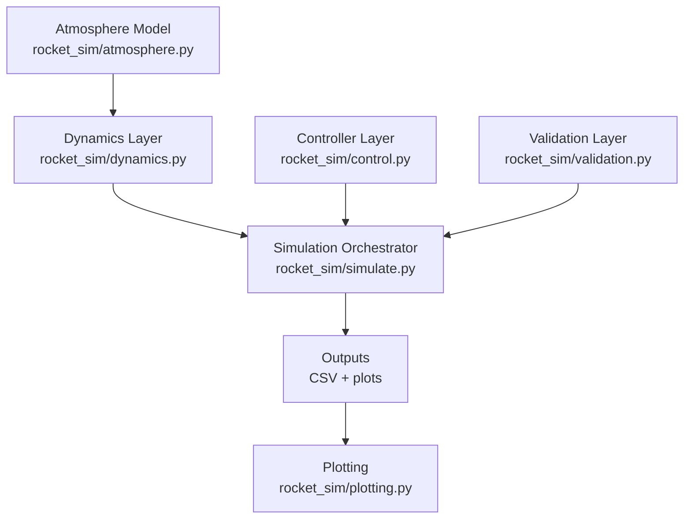

# Multi-Stage Rocket Dynamics Simulator

A flight-systems simulation project for multi-stage launch vehicles with 6-DOF rigid-body propagation, closed-loop attitude control, autonomous phase/event logic, and quantitative validation against analytical and SciPy references.

## Technical Highlights

- Lock-free event engine reaches `~1.52M events/s` with `0` drops in the generated sweep (`outputs/nextgen/event_engine_metrics.csv`).
- SIMD RK4 benchmark supports AVX2 batching on x86_64 (`simd_mode=avx2`) with scalar fallback on Apple Silicon for portability.
- EKF sensor-fusion layer reports trajectory-tracking RMSE from noisy IMU/GPS measurements (example run: `2.38 m` position, `0.258 m/s` velocity).

## Tech Stack

C++, Python, NumPy, SciPy, Matplotlib

## Key Capabilities

- 6-DOF state propagation: position, velocity, attitude, body rates, and mass
- RK4 integrator for nonlinear flight dynamics
- US Standard Atmosphere 1976 density + drag + dynamic pressure (Max-Q) computation
- Closed-loop PID attitude control with TVC gimbal commands
- Multi-stage burnout/separation with configurable staging delay
- 7-state flight phase engine:
  - `IGNITION -> ASCENT -> STAGING -> COAST -> APOGEE -> REENTRY -> LANDING`
- Autonomous detection of `MECO`, `staging`, `apogee`, `reentry`, and `landing`
- Analytical baseline checks + SciPy cross-check pipeline
- Native C++ simulation core (`cpp/include/rocket_sim_cpp.hpp`, `cpp/src/rocket_sim_cpp.cpp`) with RK4, staging, atmosphere, and CSV output
- Lock-free C++ event engine (`cpp_event_engine`) using a single-producer/single-consumer ring buffer
- SIMD-vectorized RK4 batch benchmark (`cpp_simd_batch_rk4`) with AVX2 lane batching
- EKF state-estimation layer (`rocket_sim/estimation.py`) with noisy IMU/GPS measurement fusion

## Demo Artifacts

**3D Trajectory**


**Altitude / Speed / Dynamic Pressure**


**Monte Carlo Dispersion (Apogee / Max-Q)**


**Python vs C++ Runtime Benchmark**



**Event Engine Throughput / Latency**



**EKF Error vs Sensor Noise**



**SIMD Batch Runtime Comparison**



## Architecture



Layer responsibilities:

- Dynamics layer: force/torque models, mass depletion, RK4 step function
- Controller layer: PID loop producing TVC gimbal commands
- State machine/event layer: flight phases + event transitions in `simulate.py`
- Validation layer: analytical rocket-equation baseline and SciPy ODE reference checks
- Output layer: CSV state export and plot generation

## Modeling Equations

Translational dynamics:

- $\dot{r} = v$
- $\dot{v} = g(r) + \frac{F_T + F_D}{m}$
- $g(r) = -\mu \frac{r}{\|r\|^3}$

Drag and mass flow:

- $F_D = -\frac{1}{2}\rho V^2 C_d A \,\hat{v}$
- $q = \frac{1}{2}\rho V^2$
- $\dot{m} = -\frac{T}{I_{sp}g_0}$

## Assumptions and Limitations

- Point-mass gravity model with inverse-square law
- 1976 standard atmosphere profile; no real-time weather/wind field
- Simplified aerodynamic drag (lumped $C_dA$ model)
- Rigid-body approximation; no structural flex/slosh coupling
- TVC modeled with bounded gimbal commands
- Sensor noise + EKF state-estimation demo is included, but this is not yet a full flight-computer estimator stack
- No aero-heating, plume interaction, or high-fidelity CFD coupling

## Quickstart (Python)

```bash
cd /path/to/6dof-rocket-trajectory-simulator
python3 -m venv .venv
source .venv/bin/activate
pip install -r requirements.txt
MPLCONFIGDIR=$PWD/.mplconfig PYTHONPATH=. python main.py --dt 0.1 --duration 2200
```

## Scenario Configs

Run deterministic scenarios without code changes:

- `configs/nominal.yaml`
- `configs/high_wind.yaml`
- `configs/thrust_loss.yaml`
- `configs/heavy_payload.yaml`
- `configs/engine_cutoff.yaml`
- `configs/separation_anomaly.yaml`
- `configs/extreme_drag.yaml`

Example:

```bash
MPLCONFIGDIR=$PWD/.mplconfig PYTHONPATH=. python main.py --config configs/high_wind.yaml --seed 42
```

## Reproducible Commands

```bash
make test
make validate
make run
make cpp-run
make cpp-validate
make cpp-test
make parity
make montecarlo
make cpp-montecarlo
make benchmark
make failure-suite
make cpp-event
make cpp-simd
make ekf-demo
make perf-artifacts
```

## Optional C++ Baseline Build

```bash
cd /path/to/6dof-rocket-trajectory-simulator
cmake -S . -B build
cmake --build build
./build/rk4_reference
```

## C++ Simulation Core Run

```bash
cd /path/to/6dof-rocket-trajectory-simulator
make cpp-run
```

This produces `outputs/cpp_flight_states.csv` from the native C++ simulator executable (`cpp_sim`).

## C++ Validation Gate

```bash
cd /path/to/6dof-rocket-trajectory-simulator
make cpp-validate
```

`cpp_validate` executes threshold checks and event/phase ordering directly in C++.

## Python/C++ Parity Check

```bash
cd /path/to/6dof-rocket-trajectory-simulator
make parity
```

This compares Python and native C++ outputs on the same scenario and enforces metric tolerances for apogee, Max-Q, and key event times.

## Lock-Free Event Engine

```bash
cd /path/to/6dof-rocket-trajectory-simulator
make cpp-event
```

Runs an event-driven C++ simulation loop where thrust updates, stage transitions, and sensor reads are processed via a lock-free SPSC ring buffer and exports queue stats (`pushed/popped/dropped`).

## SIMD Batch RK4 Benchmark

```bash
cd /path/to/6dof-rocket-trajectory-simulator
make cpp-simd
```

Benchmarks scalar RK4 vs AVX2-batched RK4 propagation across large trajectory batches and reports runtime speedup plus batch/scalar parity error.

## EKF Sensor Fusion Demo

```bash
cd /path/to/6dof-rocket-trajectory-simulator
make ekf-demo
```

Injects IMU/GPS noise and runs a 6-state position/velocity EKF against truth trajectory states, reporting position and velocity RMSE.

## Python Binding (pybind11)

If `pybind11` is installed in your Python environment, CMake builds `rocket_sim_event_bindings` automatically.

```bash
source .venv/bin/activate
pip install pybind11
cmake -S . -B build
cmake --build build -j
```

Then from Python:

```python
import rocket_sim_event_bindings as b
print(b.run_event_engine_summary(0.1, 600.0))
```

## Performance Benchmark

```bash
cd /path/to/6dof-rocket-trajectory-simulator
make benchmark
```

Generates:

- `outputs/benchmarks/benchmark_summary.json`
- `outputs/benchmarks/runtime_comparison.png`
- `docs/PERFORMANCE_REPORT.md`

Latest benchmark (`runs=5`, `duration=1200s`, `dt=0.15s`) reports approximately **16.06x** C++ speedup over Python on this machine.

## Next-Gen Perf Artifacts

```bash
cd /path/to/6dof-rocket-trajectory-simulator
make perf-artifacts
```

Generates:

- `outputs/nextgen/event_engine_metrics.csv`
- `outputs/nextgen/event_engine_throughput_latency.png`
- `outputs/nextgen/simd_metrics.csv`
- `outputs/nextgen/simd_runtime_comparison.png`
- `outputs/nextgen/ekf_noise_sweep.csv`
- `outputs/nextgen/ekf_rmse_vs_noise.png`
- `docs/PERF_PROFILE_REPORT.md`
- x86 AVX2 run instructions: `docs/X86_AVX2_RUNBOOK.md`

## Failure-Mode Suite

```bash
cd /path/to/6dof-rocket-trajectory-simulator
make failure-suite
```

Checks non-ideal scenarios (`engine_cutoff`, `separation_anomaly`, `extreme_drag`) and verifies expected behavior.

## Debugging Case Study

- `docs/DEBUGGING_CASE_STUDY.md` documents a real Python/C++ event-time drift issue, root cause analysis, fix, and post-fix verification.

## Validation Methodology

Validation components:

- Analytical baseline: closed-form vertical-burn reference
- Numerical cross-check: SciPy `solve_ivp` against RK4 implementation
- Automated tests: atmosphere behavior, staging transitions, state-machine behavior, and error-threshold checks
- CI gate: `.github/workflows/ci.yml` runs tests, validation, and Monte Carlo smoke checks on every push/PR
- CI gate also runs native C++ validation, C++ unit tests, and Python/C++ parity checks

Reference run (`python main.py --dt 0.1 --duration 2200`):

- Apogee: `3118.50 km` at `t = 1547.9 s`
- Max-Q (ascent, 0-80 km): `36.32 kPa` at `t = 61.7 s`
- Steady-state attitude error (`t > 40 s`): `0.12 deg`
- RK4 trajectory error vs analytical baseline: `0.000%` (SciPy cross-check: `0.000%`)
- Detected events: `MECO`, `staging`, `apogee`, `reentry`

Monte Carlo dispersion (`python scripts/monte_carlo.py --runs 80 --seed 123 --duration 1200 --dt 0.15`):

- Apogee P50/P95: `2851.68 / 3286.77 km`
- Max-Q P50/P95: `36.47 / 39.02 kPa`

## Repository Structure

- `main.py`: CLI entrypoint and run summary
- `rocket_sim/models.py`: configuration and state dataclasses
- `rocket_sim/dynamics.py`: core EOM + RK4 integrator
- `rocket_sim/control.py`: PID controller logic
- `rocket_sim/simulate.py`: phase engine, event detection, simulation loop
- `rocket_sim/validation.py`: analytical/SciPy validation helpers
- `rocket_sim/plotting.py`: plot and CSV generation
- `cpp/rk4_reference.cpp`: optional C++ RK4 reference executable
- `cpp/include/rocket_sim_cpp.hpp`: C++ core data model + public simulation API
- `cpp/src/rocket_sim_cpp.cpp`: native C++ RK4 dynamics/staging implementation
- `cpp/src/sim_main.cpp`: C++ CLI simulator entrypoint
- `cpp/src/validate_main.cpp`: native C++ validation gate executable
- `cpp/src/tests_main.cpp`: native C++ unit-style regression executable
- `cpp/src/monte_carlo_main.cpp`: native C++ Monte Carlo dispersion executable
- `scripts/validate.py`: threshold gate for regression prevention
- `scripts/monte_carlo.py`: uncertainty dispersion runner
- `scripts/parity_check.py`: Python↔C++ metric parity checker
- `scripts/benchmark.py`: Python vs C++ runtime benchmark + report generator
- `scripts/failure_modes.py`: automated failure-mode behavior checks
- `docs/PERFORMANCE_REPORT.md`: benchmark results and speedup summary
- `docs/DEBUGGING_CASE_STUDY.md`: deep-dive debugging narrative
- `configs/*.yaml`: scenario configuration files
- `tests/test_sim.py`: regression and validation tests

## Tests

```bash
cd /path/to/6dof-rocket-trajectory-simulator
source .venv/bin/activate
PYTHONPATH=. pytest -q tests/test_sim.py
```
